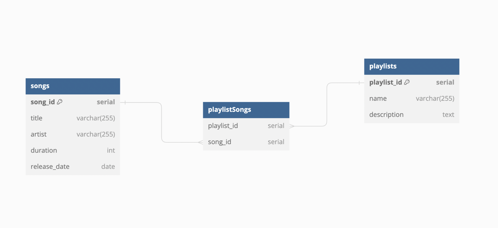

# Many-To-Many Songs and Playlists

This code demonstrates how to create a many-to-many relationship between songs and playlists. A song can have many playlists and a playlist can have many songs.

It includes ON DELETE CASCADE which allows us to delete a song simultaneously from every playlist and from the database. It also allows us to delete a playlist without deleting the songs from the playlist.

This many-to-many relationship includes a lookup table called `playlistSongs`, whose sole job is to connect the songs table and the playlists table by id. This table stores two ids. The id of the song and the id of the playlist. The songs table and the playlist table both have a one to many relationship with the lookup table. This creates a many-to-many relationship between songs and playlists.

Mentally challenging, yes. See the ERD below.

What is important to remember is:

In order to retrieve all the songs in a playlist OR all the playlists in which a song is included, you must SELECT FROM the `playlistSongs` table and JOIN ON the other two tables based on their ids. This gives you access to all of the information that connects every song and playlist. See the `getAllSongPlaylists` function in `/queries/songs.js` and the `songsFromPlaylist` function in the `/queries/playlists.js`

`ERD`

