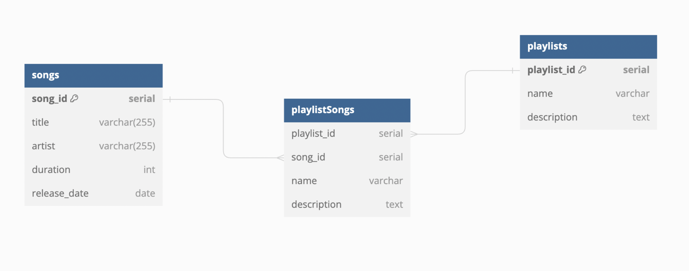

# Many-To-Many Songs and Playlists

This code demonstrates how to create a many-to-many relationship between songs and playlists. A song can have many playlists and a playlist can have many songs.

It includes ON DELETE CASCADE which allows us to delete a song simultaneously from every playlist and from the database. It also allows us to delete a playlist without deleting the songs from the playlist.

This many-to-many relationship includes a lookup table called `playlistSongs`. This table stores two ids. The id of the song and the id of the playlist. In order to retrieve all the songs in a playlist OR all the playlists a song is a part of, you must Select FROM the `playlistSongs` table and JOIN ON the other two tables based on their ids

`ERD`

